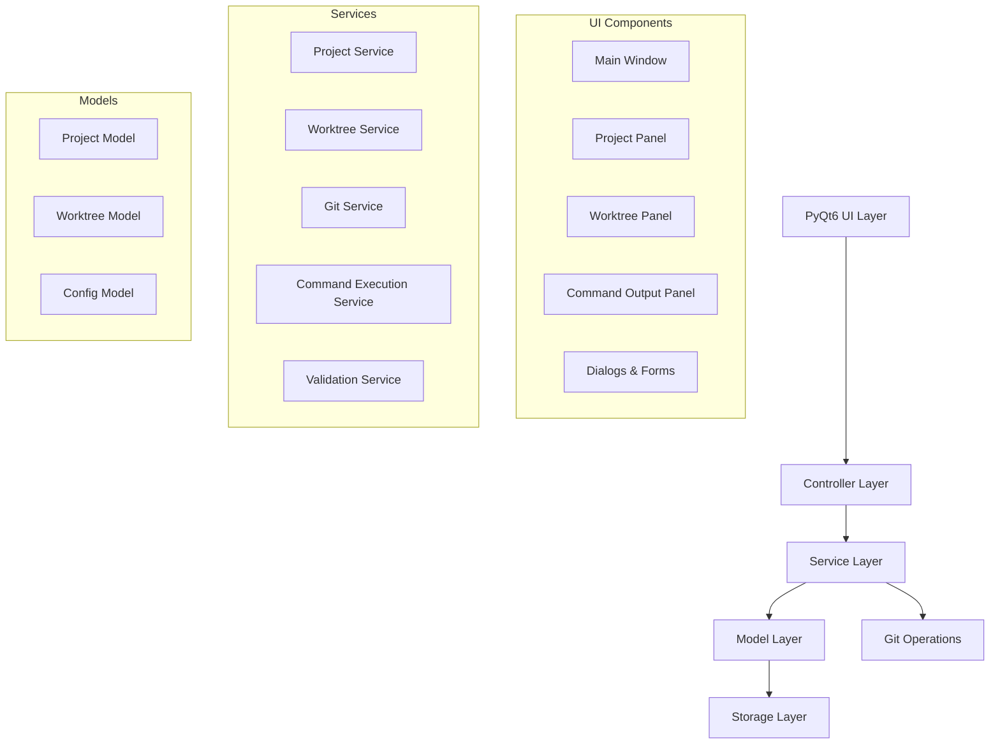

# Design Document

## Overview

The Git Worktree Manager is architected as a modern PyQt6 desktop application using the Model-View-Controller (MVC) pattern with a clean separation of concerns. The application manages multiple Git projects, each containing one or more worktrees, through a dual-pane interface that provides intuitive project navigation and worktree management.

The core design principles include:

- **Separation of Concerns**: Clear boundaries between UI, business logic, and data access
- **Asynchronous Operations**: Non-blocking Git operations with progress feedback
- **Extensible Architecture**: Plugin-ready design for future enhancements
- **Robust Error Handling**: Comprehensive validation and user-friendly error messages
- **Persistent State**: Reliable project configuration storage and recovery

## Architecture

### High-Level Architecture



### Application Structure

The application follows a layered architecture:

1. **UI Layer**: PyQt6 widgets and windows
2. **Controller Layer**: Event handling and UI coordination
3. **Service Layer**: Business logic and Git operations
4. **Model Layer**: Data structures and state management
5. **Storage Layer**: Configuration persistence and data access

## Components and Interfaces

### Core Components

#### 1. Main Application (`MainApplication`)

- **Purpose**: Application entry point and lifecycle management
- **Responsibilities**:
  - Initialize PyQt6 application
  - Load configuration and restore window state
  - Coordinate application shutdown
  - Handle global error recovery

#### 2. Main Window (`MainWindow`)

- **Purpose**: Primary application window and layout management
- **Key Features**:
  - Dual-pane layout (Projects | Worktrees)
  - Menu bar with application actions
  - Status bar with operation feedback
  - Toolbar with common actions
- **Layout Structure**:
  ```
  ┌─────────────────────────────────────┐
  │ Menu Bar                            │
  ├─────────────────────────────────────┤
  │ Toolbar                             │
  ├─────────────┬───────────────────────┤
  │ Projects    │ Worktrees             │
  │ Panel       │ Panel                 │
  │             │                       │
  │ [Project 1] │ [Worktree 1] [main]   │
  │ [Project 2] │ [Worktree 2] [dev]    │
  │ [+ Add]     │ [+ New Worktree]      │
  ├─────────────┴───────────────────────┤
  │ Command Output Panel (Collapsible)  │
  │ $ npm test                          │
  │ > Running tests...                  │
  │ ✓ All tests passed                  │
  ├─────────────────────────────────────┤
  │ Status Bar                          │
  └─────────────────────────────────────┘
  ```

#### 3. Project Panel (`ProjectPanel`)

- **Purpose**: Display and manage Git projects
- **Features**:
  - Project list with status indicators
  - Add/remove project actions
  - Project validation and health checks
  - Context menu for project operations

#### 4. Worktree Panel (`WorktreePanel`)

- **Purpose**: Display and manage worktrees for selected project
- **Features**:
  - Worktree list with branch and status information
  - Create/remove worktree actions
  - Context menu for worktree operations (including "Run Command")
  - Detailed worktree information display

#### 5. Command Output Panel (`CommandOutputPanel`)

- **Purpose**: Display real-time command execution output and results
- **Features**:
  - Collapsible panel that expands when commands are executed
  - Real-time streaming of stdout and stderr
  - Syntax highlighting for command output
  - Command history and execution status
  - Clear output and copy functionality
  - Execution time and exit code display

### Service Layer

#### 1. Project Service (`ProjectService`)

- **Interface**:
  ```python
  class ProjectService:
      def add_project(self, path: str) -> Project
      def remove_project(self, project_id: str) -> bool
      def validate_project(self, path: str) -> ValidationResult
      def get_projects(self) -> List[Project]
      def refresh_project(self, project_id: str) -> Project
  ```

#### 2. Worktree Service (`WorktreeService`)

- **Interface**:
  ```python
  class WorktreeService:
      def get_worktrees(self, project: Project) -> List[Worktree]
      def create_worktree(self, project: Project, path: str, branch: str) -> Worktree
      def remove_worktree(self, worktree: Worktree, force: bool = False) -> bool
      def validate_worktree_creation(self, path: str, branch: str) -> ValidationResult
  ```

#### 3. Git Service (`GitService`)

- **Interface**:
  ```python
  class GitService:
      def execute_command(self, command: List[str], cwd: str) -> CommandResult
      def get_worktree_list(self, repo_path: str) -> List[Dict]
      def create_worktree(self, repo_path: str, worktree_path: str, branch: str) -> CommandResult
      def remove_worktree(self, worktree_path: str, force: bool = False) -> CommandResult
      def fetch_remote(self, repo_path: str) -> CommandResult
      def get_branch_list(self, repo_path: str) -> List[str]
  ```

#### 4. Command Execution Service (`CommandService`)

- **Interface**:
  ```python
  class CommandService:
      def execute_command(self, command: str, worktree_path: str) -> CommandExecution
      def get_command_history(self, worktree_path: str) -> List[CommandExecution]
      def cancel_command(self, execution_id: str) -> bool
      def validate_command(self, command: str) -> ValidationResult
  ```

#### 5. Validation Service (`ValidationService`)

- **Interface**:
  ```python
  class ValidationService:
      def validate_git_repository(self, path: str) -> ValidationResult
      def validate_worktree_path(self, path: str) -> ValidationResult
      def validate_branch_name(self, branch: str) -> ValidationResult
      def check_uncommitted_changes(self, worktree_path: str) -> ValidationResult
      def validate_command_safety(self, command: str) -> ValidationResult
  ```

## Data Models

### Core Data Structures

#### 1. Project Model

```python
@dataclass
class Project:
    id: str
    name: str
    path: str
    status: ProjectStatus
    last_accessed: datetime
    worktrees: List[Worktree] = field(default_factory=list)

    def is_valid(self) -> bool
    def get_display_name(self) -> str
    def refresh_worktrees(self) -> None
```

#### 2. Worktree Model

```python
@dataclass
class Worktree:
    path: str
    branch: str
    commit_hash: str
    is_bare: bool
    is_detached: bool
    has_uncommitted_changes: bool
    last_modified: datetime

    def get_status_display(self) -> str
    def is_current_directory(self) -> bool
    def get_relative_path(self, base_path: str) -> str
```

#### 3. Command Execution Model

```python
@dataclass
class CommandExecution:
    id: str
    command: str
    worktree_path: str
    start_time: datetime
    end_time: Optional[datetime]
    exit_code: Optional[int]
    stdout: str
    stderr: str
    status: CommandStatus  # RUNNING, COMPLETED, FAILED, CANCELLED

    def is_running(self) -> bool
    def get_duration(self) -> Optional[timedelta]
    def get_formatted_output(self) -> str
```

#### 4. Configuration Model

```python
@dataclass
class AppConfig:
    projects: List[ProjectConfig]
    window_geometry: Dict[str, int]
    preferences: UserPreferences
    command_history: Dict[str, List[CommandExecution]]

    def save(self) -> None
    def load(self) -> 'AppConfig'
    def add_project(self, project: ProjectConfig) -> None
    def remove_project(self, project_id: str) -> None
    def add_command_execution(self, execution: CommandExecution) -> None
```

### State Management

The application uses a centralized state management approach:

- **Project State**: Managed by `ProjectManager` singleton
- **UI State**: Managed by individual controllers
- **Configuration State**: Managed by `ConfigManager`
- **Operation State**: Managed by `OperationManager` for async operations
- **Command State**: Managed by `CommandManager` for active command executions

## Error Handling

### Error Categories

1. **Git Operation Errors**

   - Repository not found
   - Invalid Git commands
   - Network connectivity issues
   - Permission errors

2. **File System Errors**

   - Path not accessible
   - Insufficient permissions
   - Disk space issues
   - Path conflicts

3. **Validation Errors**

   - Invalid repository structure
   - Branch name conflicts
   - Worktree path conflicts
   - Configuration errors

4. **Command Execution Errors**
   - Command not found
   - Permission denied
   - Command timeout
   - Process termination errors

### Error Handling Strategy

```python
class ErrorHandler:
    def handle_git_error(self, error: GitError) -> UserAction
    def handle_filesystem_error(self, error: FileSystemError) -> UserAction
    def handle_validation_error(self, error: ValidationError) -> UserAction
    def handle_command_error(self, error: CommandError) -> UserAction
    def show_error_dialog(self, error: AppError) -> None
    def log_error(self, error: Exception) -> None
```

### User Feedback Mechanisms

- **Progress Dialogs**: For long-running operations
- **Status Bar Messages**: For quick feedback
- **Error Dialogs**: For detailed error information
- **Validation Tooltips**: For inline validation feedback
- **Success Notifications**: For operation confirmations
- **Real-time Command Output**: For command execution feedback
- **Command Status Indicators**: For running command visualization

## Testing Strategy

### Testing Pyramid

1. **Unit Tests** (70%)

   - Service layer logic
   - Model validation
   - Utility functions
   - Git command parsing
   - Command execution logic

2. **Integration Tests** (20%)

   - Service interactions
   - File system operations
   - Git command execution
   - Command execution workflows
   - Configuration persistence

3. **UI Tests** (10%)
   - Critical user workflows
   - Dialog interactions
   - Error handling flows
   - Keyboard shortcuts

### Test Structure

```
tests/
├── unit/
│   ├── services/
│   ├── models/
│   ├── command_execution/
│   └── utils/
├── integration/
│   ├── git_operations/
│   ├── command_workflows/
│   ├── file_system/
│   └── configuration/
└── ui/
    ├── workflows/
    ├── command_panel/
    └── dialogs/
```

### Mock Strategy

- **Git Operations**: Mock `GitService` for predictable testing
- **Command Execution**: Mock `CommandService` and subprocess calls
- **File System**: Use temporary directories for isolation
- **UI Components**: Mock heavy UI components for unit tests
- **External Dependencies**: Mock system calls and external processes

### Test Data Management

- **Test Repositories**: Pre-configured Git repositories for testing
- **Configuration Fixtures**: Sample configuration files
- **Mock Data**: Realistic project and worktree data
- **Error Scenarios**: Predefined error conditions for testing

## Performance Considerations

### Optimization Strategies

1. **Lazy Loading**: Load worktree information on demand
2. **Caching**: Cache Git command results with TTL
3. **Background Operations**: Use QThread for Git operations and command execution
4. **Debouncing**: Debounce rapid UI updates
5. **Memory Management**: Proper cleanup of Qt objects and command processes
6. **Process Management**: Efficient handling of concurrent command executions

### Scalability Limits

- **Projects**: Designed to handle 50+ projects efficiently
- **Worktrees**: Up to 100 worktrees per project
- **UI Responsiveness**: Sub-100ms response for UI interactions
- **Git Operations**: Timeout after 30 seconds for Git commands
- **Command Execution**: Configurable timeout for user commands (default 5 minutes)
- **Concurrent Commands**: Support up to 5 simultaneous command executions

## Configuration and Logging

### OS-Specific Storage Locations

The application follows OS conventions for configuration and log storage:

#### Configuration Storage

- **macOS**: `~/Library/Application Support/GitWorktreeManager/`
- **Windows**: `%APPDATA%/GitWorktreeManager/`
- **Linux**: `~/.config/git-worktree-manager/`

#### Log Storage

- **macOS**: `~/Library/Logs/GitWorktreeManager/`
- **Windows**: `%LOCALAPPDATA%/GitWorktreeManager/Logs/`
- **Linux**: `~/.local/share/git-worktree-manager/logs/`

#### Configuration Files Structure

```
config/
├── app_config.json          # Main application configuration
├── projects.json            # Project definitions and settings
├── window_state.json        # Window geometry and UI state
└── preferences.json         # User preferences and settings

logs/
├── app.log                  # Main application log
├── git_operations.log       # Git command execution log
├── command_execution.log    # User command execution log
└── errors.log              # Error and exception log
```

#### Path Management Service

```python
class PathManager:
    @staticmethod
    def get_config_dir() -> Path:
        """Get OS-appropriate configuration directory"""

    @staticmethod
    def get_log_dir() -> Path:
        """Get OS-appropriate log directory"""

    @staticmethod
    def get_cache_dir() -> Path:
        """Get OS-appropriate cache directory"""

    @staticmethod
    def ensure_directories() -> None:
        """Create necessary directories if they don't exist"""
```

### Logging Strategy

#### Log Levels and Categories

- **DEBUG**: Detailed diagnostic information
- **INFO**: General application flow and operations
- **WARNING**: Potentially harmful situations
- **ERROR**: Error events that don't stop the application
- **CRITICAL**: Serious errors that may cause termination

#### Log Rotation

- **File Size**: Rotate when logs exceed 10MB
- **Retention**: Keep last 5 log files
- **Compression**: Compress rotated logs to save space

## Security Considerations

### Input Validation

- **Path Sanitization**: Prevent directory traversal attacks
- **Command Injection**: Sanitize all Git command parameters and user commands
- **File Permissions**: Validate file system permissions before operations
- **Branch Names**: Validate branch names against Git standards
- **Command Safety**: Validate and sanitize user-provided commands to prevent malicious execution

### Data Protection

- **Configuration Security**: Store sensitive data securely in OS-appropriate locations
- **Temporary Files**: Clean up temporary files after operations
- **Process Isolation**: Isolate Git operations from main process
- **Error Information**: Sanitize error messages to prevent information leakage
- **Log Security**: Ensure log files have appropriate permissions and don't contain sensitive data
