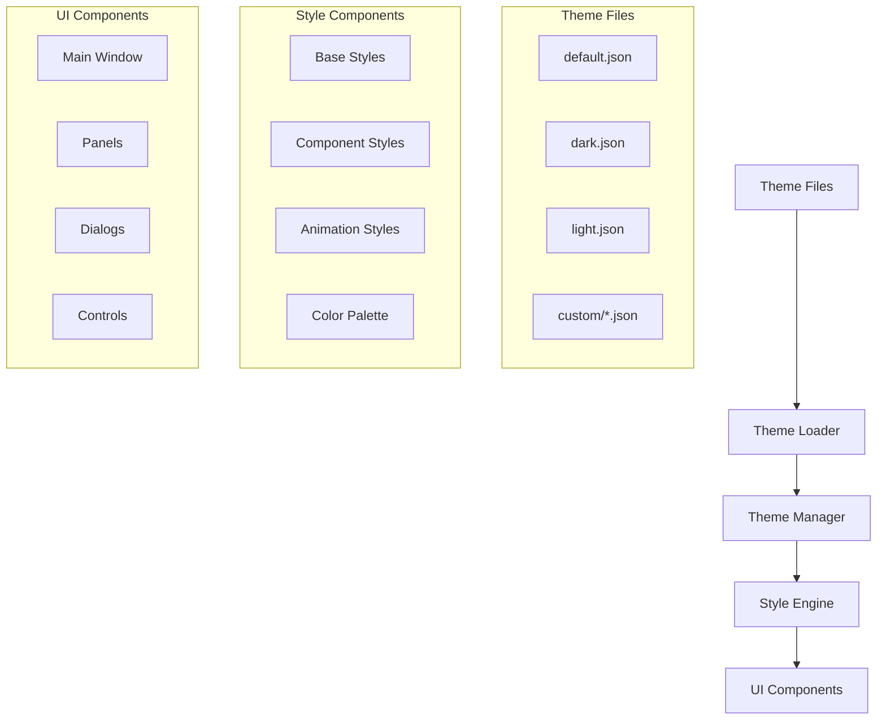

# Design Document

## Overview

The UI Modernization feature transforms the Git Worktree Manager into a contemporary desktop application with a sophisticated theming system. The design implements a clean, modern interface using PyQt6's styling capabilities while maintaining separation of concerns between visual presentation and application logic.

The modernization focuses on:

- **Theme Architecture**: Centralized theme management with hot-swapping capabilities
- **Modern Visual Design**: Contemporary color schemes, typography, and spacing
- **Component Styling**: Consistent, reusable style definitions for all UI components
- **Animation System**: Smooth transitions and micro-interactions
- **Accessibility**: High contrast, proper focus indicators, and screen reader support
- **Responsive Design**: Adaptive layouts for different screen sizes and DPI settings

## Architecture

### Theme System Architecture



### Theme File Structure

```json
{
  "metadata": {
    "name": "Modern Dark",
    "version": "1.0.0",
    "author": "Git Worktree Manager",
    "description": "Modern dark theme with blue accents"
  },
  "colors": {
    "primary": "#2563eb",
    "secondary": "#64748b",
    "background": "#0f172a",
    "surface": "#1e293b",
    "surface_variant": "#334155",
    "on_background": "#f8fafc",
    "on_surface": "#e2e8f0",
    "success": "#10b981",
    "warning": "#f59e0b",
    "error": "#ef4444",
    "border": "#475569",
    "hover": "#3b82f6",
    "focus": "#60a5fa",
    "disabled": "#64748b"
  },
  "typography": {
    "font_family": "Inter, -apple-system, BlinkMacSystemFont, 'Segoe UI', sans-serif",
    "font_size_xs": "11px",
    "font_size_sm": "12px",
    "font_size_base": "14px",
    "font_size_lg": "16px",
    "font_size_xl": "18px",
    "font_size_2xl": "20px",
    "font_weight_normal": "400",
    "font_weight_medium": "500",
    "font_weight_semibold": "600",
    "font_weight_bold": "700"
  },
  "spacing": {
    "xs": "4px",
    "sm": "8px",
    "md": "12px",
    "lg": "16px",
    "xl": "20px",
    "2xl": "24px",
    "3xl": "32px",
    "4xl": "40px"
  },
  "borders": {
    "radius_sm": "4px",
    "radius_md": "6px",
    "radius_lg": "8px",
    "radius_xl": "12px",
    "width_thin": "1px",
    "width_medium": "2px",
    "width_thick": "3px"
  },
  "shadows": {
    "sm": "0 1px 2px 0 rgba(0, 0, 0, 0.05)",
    "md": "0 4px 6px -1px rgba(0, 0, 0, 0.1), 0 2px 4px -1px rgba(0, 0, 0, 0.06)",
    "lg": "0 10px 15px -3px rgba(0, 0, 0, 0.1), 0 4px 6px -2px rgba(0, 0, 0, 0.05)",
    "xl": "0 20px 25px -5px rgba(0, 0, 0, 0.1), 0 10px 10px -5px rgba(0, 0, 0, 0.04)"
  },
  "animations": {
    "duration_fast": "150ms",
    "duration_normal": "250ms",
    "duration_slow": "350ms",
    "easing_ease": "ease",
    "easing_ease_in": "ease-in",
    "easing_ease_out": "ease-out",
    "easing_ease_in_out": "ease-in-out"
  }
}
```

## Components and Interfaces

### Core Theme Components

#### 1. Theme Manager (`ThemeManager`)

**Purpose**: Central theme management and application

**Interface**:

```python
class ThemeManager:
    def __init__(self, app: QApplication)
    def load_theme(self, theme_name: str) -> bool
    def get_available_themes(self) -> List[str]
    def get_current_theme(self) -> Theme
    def register_theme_change_callback(self, callback: Callable) -> None
    def apply_theme_to_widget(self, widget: QWidget) -> None
    def get_color(self, color_key: str) -> QColor
    def get_font(self, font_key: str) -> QFont
    def get_spacing(self, spacing_key: str) -> int
```

#### 2. Theme Loader (`ThemeLoader`)

**Purpose**: Load and validate theme files

**Interface**:

```python
class ThemeLoader:
    def load_theme_file(self, file_path: str) -> Theme
    def validate_theme(self, theme_data: dict) -> ValidationResult
    def get_builtin_themes(self) -> List[Theme]
    def scan_custom_themes(self) -> List[Theme]
    def create_theme_from_dict(self, data: dict) -> Theme
```

#### 3. Style Engine (`StyleEngine`)

**Purpose**: Generate and apply PyQt6 stylesheets

**Interface**:

```python
class StyleEngine:
    def __init__(self, theme_manager: ThemeManager)
    def generate_stylesheet(self, component_type: str) -> str
    def apply_component_style(self, widget: QWidget, style_class: str) -> None
    def register_style_template(self, name: str, template: str) -> None
    def get_component_stylesheet(self, component: str, theme: Theme) -> str
```

#### 4. Animation Controller (`AnimationController`)

**Purpose**: Manage smooth transitions and animations

**Interface**:

```python
class AnimationController:
    def create_fade_animation(self, widget: QWidget, duration: int) -> QPropertyAnimation
    def create_slide_animation(self, widget: QWidget, direction: str) -> QPropertyAnimation
    def create_color_transition(self, widget: QWidget, property: str) -> QPropertyAnimation
    def animate_button_hover(self, button: QPushButton) -> None
    def animate_panel_expand(self, panel: QWidget) -> None
```

### Styled Component Library

#### 1. Modern Button (`ModernButton`)

**Features**:

- Rounded corners with theme-based radius
- Smooth hover and press animations
- Multiple variants (primary, secondary, outline, ghost)
- Icon support with proper spacing
- Loading state with spinner animation

**Style Classes**:

```css
.modern-button {
  background-color: var(--surface);
  border: 1px solid var(--border);
  border-radius: var(--radius-md);
  padding: var(--spacing-sm) var(--spacing-lg);
  font-size: var(--font-size-base);
  font-weight: var(--font-weight-medium);
  color: var(--on-surface);
}

.modern-button:hover {
  background-color: var(--hover);
  border-color: var(--primary);
}

.modern-button.primary {
  background-color: var(--primary);
  color: white;
  border-color: var(--primary);
}
```

#### 2. Modern Panel (`ModernPanel`)

**Features**:

- Card-based design with subtle shadows
- Rounded corners and proper spacing
- Header with title and optional actions
- Collapsible content with smooth animations
- Status indicators and badges

#### 3. Modern List Widget (`ModernListWidget`)

**Features**:

- Clean item separation with subtle borders
- Hover effects with background color changes
- Selection states with accent colors
- Icon and text alignment
- Context menu integration

#### 4. Modern Dialog (`ModernDialog`)

**Features**:

- Backdrop blur effect
- Smooth fade-in animation
- Modern button layout
- Proper spacing and typography
- Responsive sizing

### Theme Variants

#### 1. Default Light Theme

**Characteristics**:

- Clean white backgrounds
- Subtle gray borders and dividers
- Blue accent colors
- High contrast text
- Minimal shadows

**Color Palette**:

```json
{
  "primary": "#2563eb",
  "background": "#ffffff",
  "surface": "#f8fafc",
  "surface_variant": "#f1f5f9",
  "on_background": "#0f172a",
  "on_surface": "#334155",
  "border": "#e2e8f0"
}
```

#### 2. Modern Dark Theme

**Characteristics**:

- Dark slate backgrounds
- Subtle blue accents
- High contrast white text
- Glowing focus indicators
- Deeper shadows

**Color Palette**:

```json
{
  "primary": "#3b82f6",
  "background": "#0f172a",
  "surface": "#1e293b",
  "surface_variant": "#334155",
  "on_background": "#f8fafc",
  "on_surface": "#e2e8f0",
  "border": "#475569"
}
```

#### 3. High Contrast Theme

**Characteristics**:

- Maximum contrast ratios
- Bold borders and outlines
- Large focus indicators
- Accessibility-optimized colors
- Clear visual hierarchy

## Data Models

### Theme Data Structure

```python
@dataclass
class Theme:
    metadata: ThemeMetadata
    colors: ColorPalette
    typography: Typography
    spacing: Spacing
    borders: Borders
    shadows: Shadows
    animations: Animations

    def get_color(self, key: str) -> QColor
    def get_font(self, key: str) -> QFont
    def get_spacing(self, key: str) -> int
    def to_dict(self) -> dict
    def from_dict(cls, data: dict) -> 'Theme'

@dataclass
class ColorPalette:
    primary: str
    secondary: str
    background: str
    surface: str
    surface_variant: str
    on_background: str
    on_surface: str
    success: str
    warning: str
    error: str
    border: str
    hover: str
    focus: str
    disabled: str

    def get_qcolor(self, key: str) -> QColor

@dataclass
class Typography:
    font_family: str
    font_size_xs: str
    font_size_sm: str
    font_size_base: str
    font_size_lg: str
    font_size_xl: str
    font_size_2xl: str
    font_weight_normal: str
    font_weight_medium: str
    font_weight_semibold: str
    font_weight_bold: str

    def get_font(self, size_key: str, weight_key: str = "normal") -> QFont
```

### Style Template System

```python
@dataclass
class StyleTemplate:
    name: str
    template: str
    variables: List[str]

    def render(self, theme: Theme) -> str
    def validate_variables(self, theme: Theme) -> bool

class StyleTemplateRegistry:
    def register_template(self, template: StyleTemplate) -> None
    def get_template(self, name: str) -> StyleTemplate
    def render_all_templates(self, theme: Theme) -> dict
```

## Error Handling

### Theme Loading Errors

1. **Invalid Theme File**

   - Malformed JSON structure
   - Missing required properties
   - Invalid color values
   - Unsupported theme version

2. **Theme Application Errors**

   - Stylesheet compilation failures
   - Missing font resources
   - Color parsing errors
   - Animation setup failures

3. **Custom Theme Errors**
   - Theme file not found
   - Permission denied accessing theme files
   - Theme validation failures
   - Incomplete theme definitions

### Error Recovery Strategy

```python
class ThemeErrorHandler:
    def handle_theme_load_error(self, error: ThemeLoadError) -> None
    def fallback_to_default_theme(self) -> None
    def validate_theme_completeness(self, theme: Theme) -> ValidationResult
    def repair_incomplete_theme(self, theme: Theme) -> Theme
    def log_theme_error(self, error: Exception) -> None
```

## Testing Strategy

### Theme System Testing

1. **Unit Tests**

   - Theme loading and validation
   - Color palette parsing
   - Style template rendering
   - Animation controller functionality

2. **Integration Tests**

   - Theme application to components
   - Theme switching workflows
   - Custom theme loading
   - Error handling and recovery

3. **Visual Tests**
   - Screenshot comparison testing
   - Theme consistency across components
   - Animation smoothness validation
   - Accessibility compliance testing

### Test Structure

```
tests/
├── unit/
│   ├── theme/
│   │   ├── test_theme_manager.py
│   │   ├── test_theme_loader.py
│   │   ├── test_style_engine.py
│   │   └── test_animation_controller.py
│   └── components/
│       ├── test_modern_button.py
│       ├── test_modern_panel.py
│       └── test_modern_dialog.py
├── integration/
│   ├── test_theme_switching.py
│   ├── test_custom_themes.py
│   └── test_theme_persistence.py
└── visual/
    ├── test_theme_consistency.py
    ├── test_animations.py
    └── test_accessibility.py
```

## Performance Considerations

### Optimization Strategies

1. **Theme Caching**

   - Cache compiled stylesheets
   - Lazy load theme resources
   - Reuse color and font objects
   - Cache animation objects

2. **Efficient Style Application**

   - Batch stylesheet updates
   - Minimize widget redraws
   - Use efficient CSS selectors
   - Optimize animation performance

3. **Memory Management**
   - Proper cleanup of animation objects
   - Release unused theme resources
   - Efficient color object management
   - Smart caching with TTL

### Performance Metrics

- **Theme Switch Time**: < 200ms for complete theme application
- **Animation Frame Rate**: 60 FPS for smooth animations
- **Memory Usage**: < 10MB additional memory for theme system
- **Startup Impact**: < 100ms additional startup time

## Accessibility Features

### WCAG 2.1 Compliance

1. **Color Contrast**

   - Minimum 4.5:1 contrast ratio for normal text
   - Minimum 3:1 contrast ratio for large text
   - High contrast theme option available
   - Color-blind friendly color choices

2. **Focus Management**

   - Clear focus indicators with 2px minimum outline
   - Logical tab order throughout interface
   - Focus trapping in modal dialogs
   - Keyboard navigation support

3. **Screen Reader Support**
   - Proper ARIA labels and descriptions
   - Semantic HTML structure
   - Alternative text for icons
   - Status announcements for dynamic content

### Accessibility Testing

```python
class AccessibilityTester:
    def test_color_contrast(self, theme: Theme) -> ContrastReport
    def test_focus_indicators(self, widget: QWidget) -> FocusReport
    def test_keyboard_navigation(self, window: QMainWindow) -> NavigationReport
    def test_screen_reader_compatibility(self) -> ScreenReaderReport
```

## Implementation Phases

### Phase 1: Core Theme System (Week 1-2)

1. Implement `ThemeManager` and `ThemeLoader`
2. Create base theme file structure
3. Implement `StyleEngine` with basic templates
4. Create default light and dark themes

### Phase 2: Component Modernization (Week 3-4)

1. Implement modern button components
2. Update panel and dialog styling
3. Modernize list widgets and tables
4. Add icon system integration

### Phase 3: Animation System (Week 5)

1. Implement `AnimationController`
2. Add hover and transition animations
3. Create smooth panel expand/collapse
4. Add loading and progress animations

### Phase 4: Advanced Features (Week 6)

1. Custom theme support
2. Theme import/export functionality
3. Advanced accessibility features
4. Performance optimizations

### Phase 5: Polish and Testing (Week 7)

1. Comprehensive testing suite
2. Documentation and examples
3. Performance tuning
4. Final accessibility audit

## Configuration and Storage

### Theme Storage Structure

```
themes/
├── builtin/
│   ├── default.json
│   ├── dark.json
│   └── high-contrast.json
├── custom/
│   └── user-themes/
└── cache/
    ├── compiled-styles/
    └── theme-previews/
```

### Theme Configuration

```python
@dataclass
class ThemeConfig:
    current_theme: str
    custom_theme_paths: List[str]
    animation_enabled: bool
    high_contrast_mode: bool
    font_scaling: float

    def save(self) -> None
    def load(self) -> 'ThemeConfig'
    def reset_to_defaults(self) -> None
```

The modernized UI will transform the Git Worktree Manager into a contemporary, professional application while maintaining all existing functionality and improving user experience through thoughtful design and smooth interactions.
